<div align="center">

</div>

<div align="center">


<!--START_SECTION:UPTIME-->
`SYSTEM UPTIME: calculating...`
<!--END_SECTION:UPTIME-->

<!--START_SECTION:LASTBOOT-->
`last self-update: pending first run`
<!--END_SECTION:LASTBOOT-->

</div>

<br>

> This README is not static. A GitHub Action rewrites the sections below every day —
> the uptime counter, the quote, and a hidden cipher all regenerate on their own.
> You are not reading a page. You are reading a process that happens to render as one.

<br>

## `$ cat about.txt`

```bash
> booting sa7thak_os v3.0 ...
> loading modules: [nextjs] [tailwind] [supabase] [telegram-api] [jwt-auth] ... done
> mounting /dev/curiosity ... success
> checking for excuses ... none found
> current_project: TeleDrive — cloud storage that hijacks Telegram's servers
>                  for free, unlimited storage. because paying for S3
>                  is for people who didn't read the Bot API docs.
> known_bugs: none i'll admit to in a README
> philosophy: ship it, break it, fix it, ship it again.
> process complete. you may proceed.
```

<br>

## `$ ./skills --render=custom`

```
FRONTEND    ██████████████████░░  90%   Next.js · React · Tailwind
BACKEND     ████████████████░░░░  80%   Node.js · Supabase · PostgreSQL
AUTH/SEC    ██████████████░░░░░░  70%   JWT · OAuth flows
INFRA/CI    ███████████████░░░░░  75%   GitHub Actions · workflow automation
DEBUGGING   ████████████████████ 100%   fueled by desperation and stack overflow
```

<br>

## `$ ./run --project=featured`

<table align="center">
<tr>
<td width="640">

### 📦 TeleDrive
**Cloud storage, but Telegram unknowingly pays the infra bill.**

Full-stack file storage built end-to-end: file previews (images/video/audio/PDF), folder trees, bulk actions, shareable public links, starred files, trash bin, right-click context menus, keyboard shortcuts. Redesigned twice — dark theme to a custom warm cream/orange system with its own type pairing.

`Next.js 14` `Supabase` `Telegram Bot API` `JWT` `Tailwind`

</td>
</tr>
</table>

<br>

## `$ curl api.quotable.io/random`

<!--START_SECTION:QUOTE-->
> "Talk is cheap. Show me the code."
> — Linus Torvalds
<!--END_SECTION:QUOTE-->

<br>

## `$ git log --stats`

<div align="center">


</div>

<br>

<details>
<summary>💀 <code>$ sudo access ./hidden</code> — click if you dare</summary>

<br>

You weren't supposed to open this. But since you did:

<!--START_SECTION:CIPHER-->
<!-- decoded rot13: pending first run -->
`cebprff cvat`
<!--END_SECTION:CIPHER-->

The line above is ROT13-encoded and changes every day. Decode it at
[rot13.com](https://rot13.com) — or in your head, if you're that person.

```
        .
       / \
      / _ \       YOU FOUND THE BASEMENT.
     |.o '.|       there is nothing else down here.
     |'._.'|       go outside.
     |     |
     |_____|
```

</details>

<br>

## `$ curl -s ping/socials`

<div align="center">

<a href="https://github.com/Sa7thak"></a>
<a href="#"></a>
<a href="#"></a>
<a href="#"></a>

</div>

<br>

<div align="center">

```
$ exit
process terminated. thanks for stopping by — or don't, this page updates itself either way.
[connection closed]
```


</div>
